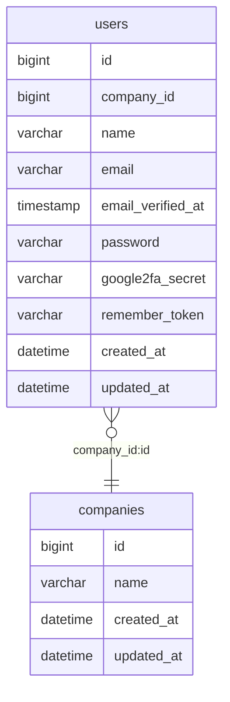

# モデルの追加



```bash
$ sail artisan make:model Company -a
```

`-a` または `--all` オプションをつけて実行することで、以下の関連ファイルを同時に生成することができ、Laravel の設計思想にあった形でファイルが出力されるため、積極的に使うのが望ましい。

- マイグレーションファイル
- モデルファクトリー
- シーダー
- リソースコントローラー
- リクエストファイル

## マイグレーションの編集

マイグレーションを作成する時は、将来的な保守性のため、テーブル・カラムにコメントをつけることを推奨します。

https://readouble.com/laravel/10.x/ja/migrations.html

### 会社

`database/migrations/YYYY_MM_DD_HHMMSS_create_companies_table.php`

```php
<?php

use Illuminate\Database\Migrations\Migration;
use Illuminate\Database\Schema\Blueprint;
use Illuminate\Support\Facades\Schema;

return new class extends Migration
{
    /**
     * Run the migrations.
     */
    public function up(): void
    {
        Schema::create('companies', function (Blueprint $table) {
            $table->comment('会社');                    # テーブルコメント追加
            $table->id()->comment('ID');                # カラムコメント追加
            $table->string('name')->comment('会社名');   # カラム追加
            $table->timestamps();
        });
    }

    /**
     * Reverse the migrations.
     */
    public function down(): void
    {
        Schema::dropIfExists('companies');
    }
};
```

### ユーザー

`database/migrations/2014_10_12_000000_create_users_table.php`

```php
<?php

use Illuminate\Database\Migrations\Migration;
use Illuminate\Database\Schema\Blueprint;
use Illuminate\Support\Facades\Schema;

return new class extends Migration
{
    /**
     * Run the migrations.
     */
    public function up(): void
    {
        Schema::create('users', function (Blueprint $table) {
            $table->id()->comment('ID');
            $table->foreignIdFor(\App\Models\Company::class)->comment('会社ID');  # 外部キーの追加
            $table->string('name')->comment('氏名');
            $table->string('email')->unique()->comment('メールアドレス');
            $table->timestamp('email_verified_at')->nullable()->comment('メール認証日時');
            $table->string('password')->comment('パスワード');
            $table->rememberToken()->comment('リメンバートークン');
            $table->timestamps();
        });
    }

    /**
     * Reverse the migrations.
     */
    public function down(): void
    {
        Schema::dropIfExists('users');
    }
};
```

## モデルの編集

### リレーションを追加する

ついでに、Company モデルに $fillable プロパティを追加

```php
<?php

namespace App\Models;

use Illuminate\Database\Eloquent\Factories\HasFactory;
use Illuminate\Database\Eloquent\Model;
use Illuminate\Database\Eloquent\Relations\HasMany;

class Company extends Model
{
    use HasFactory;
    
    protected $fillable = [
        'name',
    ];

    /**
     * @return HasMany
     */
    public function users(): HasMany
    {
        return $this->hasMany(User::class);
    }
}
```

```php
<?php

namespace App\Models;

// use Illuminate\Contracts\Auth\MustVerifyEmail;
use Illuminate\Database\Eloquent\Factories\HasFactory;
use Illuminate\Database\Eloquent\Relations\BelongsTo;
use Illuminate\Foundation\Auth\User as Authenticatable;
use Illuminate\Notifications\Notifiable;
use Laravel\Sanctum\HasApiTokens;

class User extends Authenticatable
{
    use HasApiTokens, HasFactory, Notifiable;

    /**
     * The attributes that are mass assignable.
     *
     * @var array<int, string>
     */
    protected $fillable = [
        'name',
        'email',
        'password',
    ];

    /**
     * The attributes that should be hidden for serialization.
     *
     * @var array<int, string>
     */
    protected $hidden = [
        'password',
        'remember_token',
    ];

    /**
     * The attributes that should be cast.
     *
     * @var array<string, string>
     */
    protected $casts = [
        'email_verified_at' => 'datetime',
    ];

    /**
     * @return BelongsTo
     */
    public function company(): BelongsTo
    {
        return $this->belongsTo(Company::class);
    }
}
```
